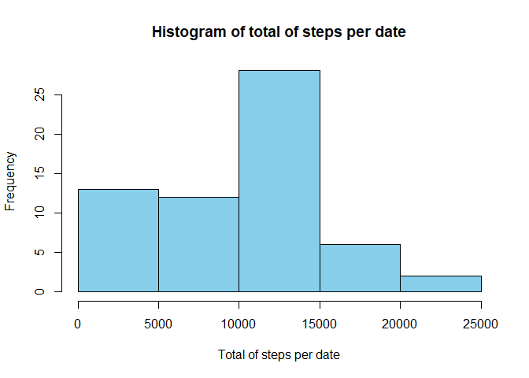
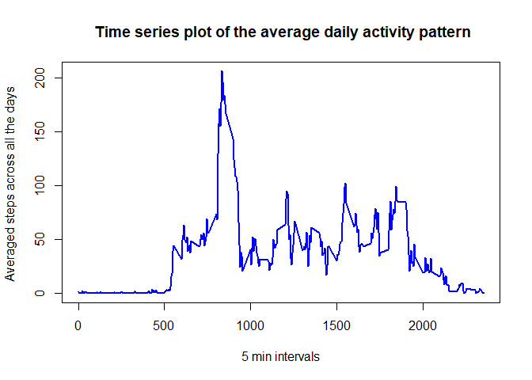
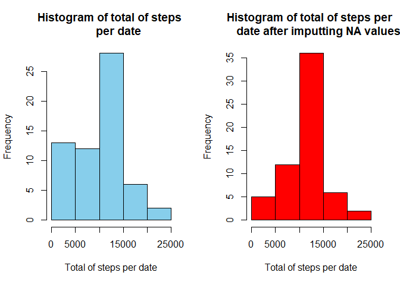
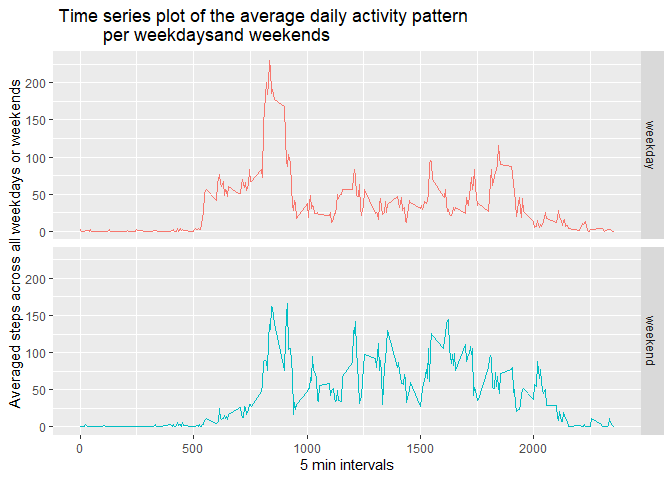

## Loading and preprocessing the data
Unzip the **activity.zip** file the repository and then read the **activity.csv** file.


```r
unzip("activity.zip")
activity <- read.csv("activity.csv")
```


## What is mean total number of steps taken per day?
1. Calculate the total number of steps taken per day.

```r
total_steps <- with(activity, tapply(steps, date, sum, na.rm = TRUE))
```
2. Make a histogram of the total number of steps taken each day.

```r
hist(total_steps, col = "skyblue", xlab = "Total of steps per date", 
     main = "Histogram of total of steps per date")
```

<!-- -->
3. Calculate and report the mean and median of the total number of steps taken per day.

```r
mean(total_steps) # mean of the total number of steps taken per day
```

```
## [1] 9354.23
```

```r
median(total_steps)# mean of the total number of steps taken per day
```

```
## [1] 10395
```

## What is the average daily activity pattern?
1. Make a time series plot (i.e. \color{red}{\verb|type = "l"|}type = "l") of the 5-minute interval (x-axis) and the average number of steps taken, averaged across all days (y-axis)


```r
avg_interval <- with(activity, tapply(steps, interval, mean, na.rm = TRUE))
plot(names(avg_interval),avg_interval, type = "l", xlab = "5 min intervals", 
     col = "blue", lwd = 2, ylab = "Averaged steps across all the days ",
     main = " Time series plot of the average daily activity pattern")
```

<!-- -->

2. Which 5-minute interval, on average across all the days in the dataset, contains the maximum number of steps?

```r
names(avg_interval[avg_interval == max(avg_interval)])
```

```
## [1] "835"
```

## Imputing missing values
1. Calculate and report the total number of missing values in the dataset (i.e. the total number of rows with \color{red}{\verb|NA|}NAs).

```r
sum(is.na(activity$steps))
```

```
## [1] 2304
```

2. Devise a strategy for filling in all of the missing values in the dataset. For each 5-minute interval with NA steps, the strategy is using the mean for that 5-minute interval across all the days.  
3. Create a new dataset that is equal to the original dataset but with the missing data filled in.


```r
na_list <- which(is.na(activity$steps))
new_activity <- activity
for (i in na_list){
  temp <- which(names(avg_interval) == activity$interval[i])
  new_activity$steps[i] <- avg_interval[temp]
}
```
4. Make a histogram of the total number of steps taken each day and Calculate and report the mean and median total number of steps taken per day. Do these values differ from the estimates from the first part of the assignment? What is the impact of imputing missing data on the estimates of the total daily number of steps?

```r
new_total_steps <- with(new_activity, tapply(steps, date, sum))
par(mfrow = c(1,2))
hist(total_steps, col = "skyblue", xlab = "Total of steps per date", 
     main = "Histogram of total of steps 
     per date")
hist(new_total_steps, col = "red", xlab = "Total of steps per date", 
     main = "Histogram of total of steps per 
     date after imputting NA values")
```

<!-- -->


Mean of the total number of steps taken per day after imputting all NA values

```r
mean(new_total_steps)
```

```
## [1] 10766.19
```
Median of total number of steps taken per day after imputting all NA values

```r
median(new_total_steps)
```

```
## [1] 10766.19
```

The impact of imputing missing data on the estimates of the total daily number of steps is to normalize the data distribution.


## Are there differences in activity patterns between weekdays and weekends?
1. Create a new factor variable in the dataset with two levels – “weekday” and “weekend” indicating whether a given date is a weekday or weekend day.

```r
new_activity$date <- as.Date(new_activity$date)
weekday <- c("Monday", "Tuesday", "Wednesday", "Thursday", "Friday")
weekend <- c("Saturday", "Sunday")
wd <- which(weekdays(new_activity$date) %in% weekday)
we <- which(weekdays(new_activity$date) %in% weekend)
new_activity$whatday[wd] <- "weekday"
new_activity$whatday[we] <- "weekend"
new_activity$whatday <- as.factor(new_activity$whatday)
head(new_activity)
```

```
##       steps       date interval whatday
## 1 1.7169811 2012-10-01        0 weekday
## 2 0.3396226 2012-10-01        5 weekday
## 3 0.1320755 2012-10-01       10 weekday
## 4 0.1509434 2012-10-01       15 weekday
## 5 0.0754717 2012-10-01       20 weekday
## 6 2.0943396 2012-10-01       25 weekday
```

```r
levels(new_activity$whatday)
```

```
## [1] "weekday" "weekend"
```

2. Make a panel plot containing a time series plot (i.e. \color{red}{\verb|type = "l"|}type = "l") of the 5-minute interval (x-axis) and the average number of steps taken, averaged across all weekday days or weekend days (y-axis). 

```r
library(ggplot2)
library(dplyr)
new_activity %>% group_by(interval, whatday) %>% 
  summarise(stepavg = mean(steps)) %>%
  ggplot(aes(interval, stepavg, color = whatday)) + 
  geom_line() +
  facet_grid(whatday~.)+
  xlab("5 min intervals")+
  ylab("Averaged steps across all weekdays or weekends")+
  ggtitle(" Time series plot of the average daily activity pattern 
          per weekdaysand weekends") +
  theme(legend.position = "none")
```

<!-- -->


